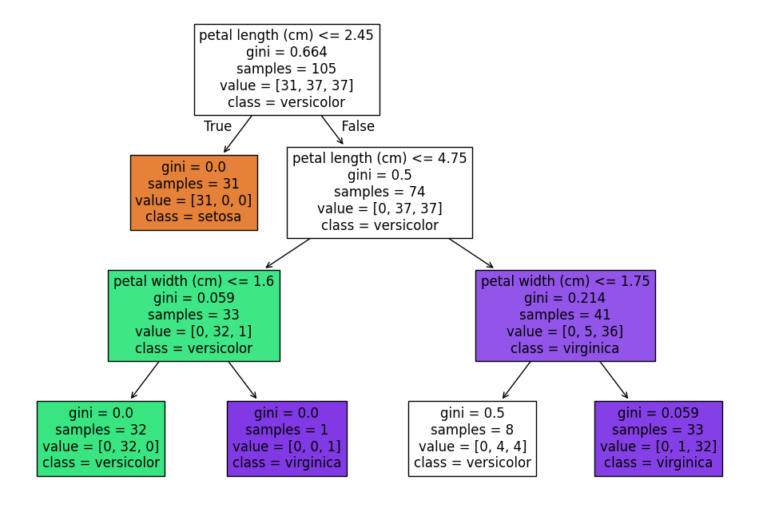

# Implementação de Árvores de Decisão e Avaliação de Desempenho
## Objetivo:
Familiarizar-se com a implementação de algoritmos de Árvore de Decisão e aplicar o
conhecimento em um problema de classificação utilizando o Iris Dataset. Você deve
implementar o algoritmo, avaliar seu desempenho e ajustar parâmetros para observar o
impacto nas previsões.

## O que foi feito:
Função para carregar e dividir o dataset, função para treinar o modelo de árvore de decisão, função para visualizar a árvore de decisão, função para avaliar o modelo, função para testar diferentes valores de max_depth e criterion, função main para chamar todas as funções auxiliares e printar os resultados.

